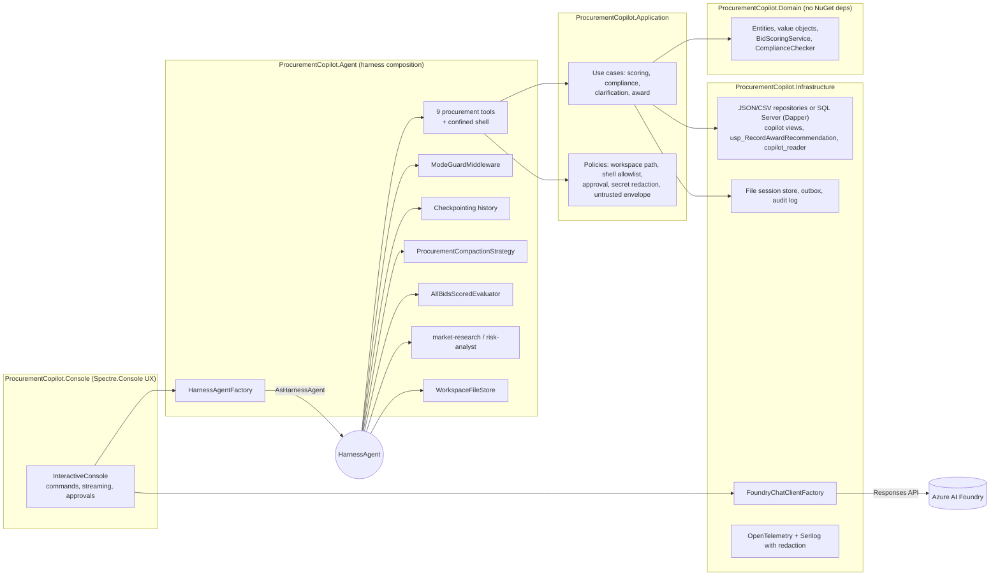

# Procurement Copilot — Microsoft Agent Framework Harness demo (.NET 10)

A complete, tested .NET 10 solution that exercises **every row of the Agent Framework Harness capability matrix**
in one realistic business scenario: a procurement analyst at *Contoso Industrial Systems* evaluating an open RFP
(`RFP-2026-017`, 40 CNC vertical machining centres, EUR) with five vendor bids — one sanctioned vendor, one missing
ISO 14001, one bid in USD and one ambiguous delivery clause.

It runs fully **offline** (`--fake`, scripted model, JSON seed data) or **live** against Azure AI Foundry / Azure OpenAI with an
API key, on either the JSON seed files or a **SQL Server backend built on AdventureWorks2019** (real vendors, purchase-order
history, an approval-gated read-only SQL tool, and awards that create pending purchase orders). A Blazor admin app edits the data.

> Quick start: `dotnet run --project src/ProcurementCopilot.Console -- --fake` and type
> `Evaluate RFP-2026-017 and recommend a vendor.` — see [how-to-run.md](how-to-run.md). The console opens a full-screen
> **TUI** (transcript, prompt, live todo / task / context / trace panels, approval dialogs); `--classic` gives the line UI.
> A second terminal can `--attach <session id>` to watch the same session live and `/takeover` it when the first exits.
> [docs/TESTING_GUIDE.md](docs/TESTING_GUIDE.md) lists, prompt by prompt, how to trigger and verify every capability.

## What it demonstrates

| Harness capability | Where it lives | Watch it in the console |
|---|---|---|
| Function invocation (9 tools + `query_readonly`, 15-iteration limit) | `Agent/Tools/*`, `HarnessAgentFactory` | `▸ score_bid(RFP-2026-017, BID-003) → 94.60` |
| Per-service-call history persistence | `Sessions/CheckpointingChatHistoryProvider` | `/session list`, `/session resume <id>`, `--attach <id>` from a second instance |
| Compaction (custom strategy) | `Compaction/ProcurementCompactionStrategy` | `/context` |
| Todo tracking | built-in `TodoProvider` | Todos panel (TUI) / todo table after each turn, `/todos` |
| Agent modes (plan / execute) | built-in `AgentModeProvider` + `Middleware/ModeGuardMiddleware` | mode badge, `/mode execute` |
| File memory and confined file access | `Files/WorkspaceFileStore` + `WorkspacePathPolicy` | memo written to `workspace/output/` |
| Tool approval (once / always / deny, audited) | `Approval/ApprovalRuleBuilder`, `Ui/ApprovalPrompt` | 🔐 approval panels, `/approvals` |
| OpenTelemetry (redacted) | `Infrastructure/Telemetry/*` | `/traces`, `logs/traces-*.jsonl` |
| Hosted web search | `WebSearch/WebSearchSupport` | market-research background agent (live mode) |
| Agent Skills (4 file-based skills) | `skills/`, `Skills/SkillsSourceFactory` | `load_skill rfp-scoring`, `load_skill database-schema` in the tool stream |
| Background agents (2 children, bounded) | `Background/*` | Background tasks panel, `/tasks` (also from an attached observer) |
| Shell execution (allowlist, sandboxed) | `Shell/*`, `ShellCommandPolicy` | `▸ shell(wc -l …)` after approval |
| Read-only SQL (allowlist policy + least-privilege user) | `Tools/QueryTools.cs`, `SqlQueryPolicy`, `SqlReadOnlyQueryExecutor` | `▸ query_readonly(SELECT … FROM copilot.PurchaseOrders …)` after approval |
| Looping (predicate + optional AI judge) | `Looping/AllBidsScoredEvaluator` | `↻ loop:` feedback lines |

The full capability → class → test map is in [docs/ARCHITECTURE.md](docs/ARCHITECTURE.md); the threat model is in
[docs/SECURITY.md](docs/SECURITY.md); the click-through, including a prompt-by-prompt live run against Azure AI Foundry,
is in [docs/DEMO_SCRIPT.md](docs/DEMO_SCRIPT.md).

## Architecture



Dependency flow: `Console → Agent → Application → Domain` and `Console → Infrastructure → Application → Domain`.

## Repository layout

```
src/ProcurementCopilot.Domain          pure domain: Result<T>, value objects, scoring, compliance
src/ProcurementCopilot.Application     options, security policies, tool contracts, use cases
src/ProcurementCopilot.Infrastructure  seed repositories, session store, outbox, audit, Foundry client, telemetry, Serilog
src/ProcurementCopilot.Agent           tools, providers, evaluators, background agents, HarnessAgentFactory
src/ProcurementCopilot.Testing         ScriptedChatClient + in-memory fakes (shared by tests and --fake mode)
src/ProcurementCopilot.Console         entry point; Tui/ (Terminal.Gui front-end), Ui/ (classic Spectre front-end), Runtime/ (session driver, lock, status, observer)
src/ProcurementCopilot.Admin           Blazor Server admin app: RFPs, bids, vendor profiles, restricted parties, awards, migrations
tests/                                 Domain, Application, Agent (fake chat client), Console (lock/status/launch), Integration (live, auto-skipped)
data/                                  seeded RFPs, vendors, bids, sanctions, FX rates (JSON backend)
database/migrations                    versioned SQL scripts: Procurement schema, copilot views, procedure + security, demo seed
database/maintenance                   reset-demo-awards.sql
workspace/rfps                         read-only RFP documents and bid letters
workspace/output                       agent-writable outputs (memo, outbox, audit) — gitignored
skills/                                rfp-scoring, compliance-check, award-memo, database-schema
docs/                                  requirements, ARCHITECTURE, SECURITY, DATABASE, DEMO_SCRIPT, TESTING_GUIDE, DEVIATIONS, OPEN_QUESTIONS, API_NOTES
scripts/                               verify.ps1 / verify.sh (restore, build, test+coverage, vuln scan, 150-line check, self-check)
                                       reset-demo.ps1 / reset-demo.sh (delete bin/logs and bin/workspace; --sessions / --all / --database)
                                       apply-migrations.ps1 / apply-migrations.sh (apply or show the database migrations)
```

## Data backends

| `Data:Provider` | Data | Scenario |
|---|---|---|
| `Json` | `data/*.json` | Contoso, 40 CNC machining centres, EUR |
| `SqlServer` | AdventureWorks2019 + `Procurement`/`copilot` schemas (`database/migrations`) | Adventure Works, 2,000 HL Mountain Tires, USD, five real vendors |
| `Auto` (default) | SQL Server when configured, reachable and migrated, else JSON | `--fake` always uses JSON |

Setup, schema, security model and the admin app: [docs/DATABASE.md](docs/DATABASE.md).

## Build and verify

```bash
./scripts/verify.sh        # or: pwsh ./scripts/verify.ps1
```

The scripts run `dotnet restore`, `dotnet build -warnaserror`, `dotnet test` with code coverage,
`dotnet list package --vulnerable`, the 150-line-per-file check and `--self-check` (host start-up without a model call).
Everything passes on a clean machine with the .NET 10 SDK and **no** Azure credentials or SQL Server; the live Foundry test
and the SQL Server integration tests are skipped automatically when their backend is not reachable.

## Security highlights

Least-privilege tools, approval-gated side effects, a plan-mode guard, one workspace confinement policy shared by file
access, shell and outbox, a shell allowlist evaluated on the parsed command line, untrusted-data envelopes around all
vendor text, a SQL allowlist policy plus a least-privilege database user for ad-hoc queries, writes to AdventureWorks only
through one stored procedure, secret redaction in logs and traces, bounded loops/iterations/timeouts and an append-only audit trail.
Details and the threat → control → test table: [docs/SECURITY.md](docs/SECURITY.md).

## Packages

Microsoft.Agents.AI 1.20.0 (+ Harness, OpenAI), Microsoft.Agents.AI.Tools.Shell 1.20.0-preview, Microsoft.Extensions.AI 10.9,
OpenTelemetry 1.18 (+ SqlClient instrumentation), Serilog, Spectre.Console, Terminal.Gui 2.4, Dapper, Microsoft.Data.SqlClient, xunit v3, Shouldly, NSubstitute. All free/OSS; versions in
`Directory.Packages.props`. Places where the implementation differs from `docs/requirements.md` are listed in
[docs/DEVIATIONS.md](docs/DEVIATIONS.md).
