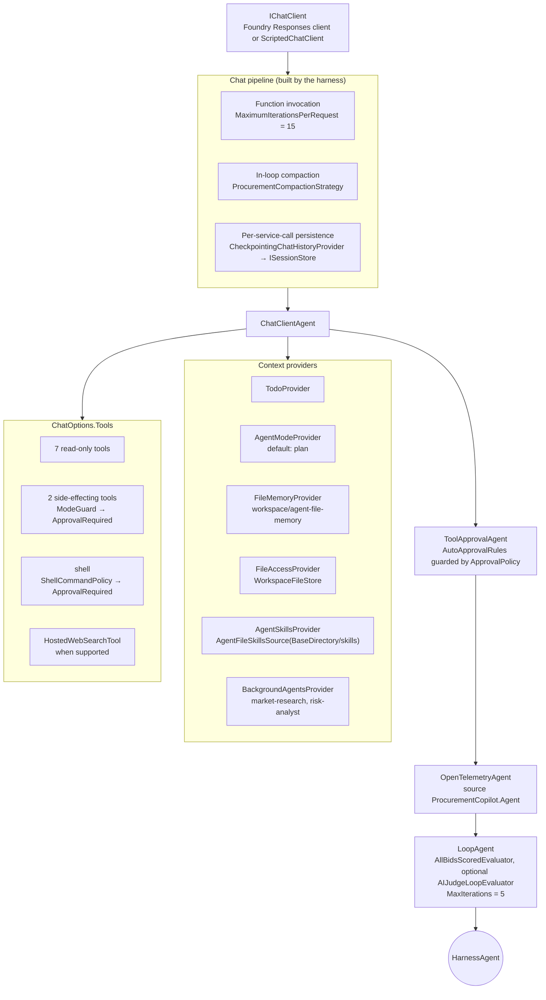

# Architecture

## Harness composition

Everything is composed in one place: `HarnessAgentFactory.BuildOptions` (`src/ProcurementCopilot.Agent/HarnessAgentFactory.cs`)
returns a fully explicit `HarnessAgentOptions`; `Create` calls `chatClient.AsHarnessAgent(options)`.



Order of the decorators (inner → outer): chat pipeline → `ChatClientAgent` with providers → `ToolApprovalAgent` → `OpenTelemetryAgent` → `LoopAgent`.
Approval requests escape the loop (the loop stops before evaluating when an iteration returns a pending approval).

## Capability map

Every row of the Harness capability matrix, the class that implements it and the test that proves it.

| # | Capability | Implementation | Test(s) |
|---|---|---|---|
| 4.1 | Function invocation | `Agent/Tools/ReadTools.cs`, `EvaluationTools.cs`, `SideEffectTools.cs`, `ProcurementToolset`; `MaximumIterationsPerRequest` from `Agent:MaxFunctionInvocationIterations`; `ToolArgumentValidator`; `UntrustedDataEnvelope` | `HarnessAgentFactoryTests.BuildOptions_FromAppSettings_SetsEveryCapabilitySwitchAsSpecified`, `BuildOptions_ConfigOverride_FlowsToIterationLimitAndLoopBound`, `ToolArgumentValidatorTests`, `UntrustedDataEnvelopeToolTests` |
| 4.2 | Per-service-call history persistence | `Sessions/CheckpointingChatHistoryProvider` (wraps `InMemoryChatHistoryProvider`, saves after every model call), `Sessions/SessionIdentity`, `Infrastructure/Sessions/FileSessionStore` (GUID file names); console `/session new|list|resume`, `--session <id>` | `SessionPersistenceTests.Run_ThreeToolCalls_StoreIsWrittenAfterEveryModelCall`, `Resume_DeserializedSession_ContainsHistoryAndScores`, `FileSessionStoreTests` |
| 4.3 | Compaction | `MaxContextWindowTokens`/`MaxOutputTokens` from config + `Compaction/ProcurementCompactionStrategy` (protects RFP id, scores, approvals, clarifications; deterministic summary; no model call); `/context` | `CompactionStrategyTests.Compact_OverSmallBudget_KeepsProtectedFactsAndFitsBudget`, `Compact_UnderBudget_DoesNothing` |
| 4.4 | Todo tracking | built-in `TodoProvider` (`DisableTodoProvider = false`); harness instructions require one todo per bid; console todo panel + `/todos` | `TodoTrackingTests.Run_TodoToolCalls_ReflectInProviderState` |
| 4.5 | Agent modes | built-in `AgentModeProvider` (`DefaultMode = plan`); `Middleware/ModeGuardMiddleware` + `Application/Security/ModeGuard` block side effects outside execute; `Middleware/RunContextModeAccessor`; `/mode` | `ModeGuardMiddlewareTests` (3), `ModeGuardTests` |
| 4.6 | File memory and file access | `FileMemoryStore` (session file memory) and opt-in `FileAccessStore = Files/WorkspaceFileStore` confined by `Application/Security/WorkspacePathPolicy` (read-only `rfps/**`, writable `output/**`, 1 MB, extension allowlist, no `..`/absolute/UNC/reparse points) | `WorkspacePathPolicyTests` (traversal table), `WorkspaceFileStoreTests` |
| 4.7 | Tool approval | `Application/Security/ApprovalPolicy` (config list is the single source of truth, guards every auto-approval rule), `Approval/ApprovalRuleBuilder` (skills + file-access read-only rules + procurement read tools), `ApprovalRequiredAIFunction` wrapping in `ProcurementToolset.Wrap`; console `Ui/ApprovalPrompt` (once / always / deny) → `approvals.jsonl` | `ApprovalPolicyTests.GuardRules_ListedTool_IsNeverAutoApprovedEvenWhenRuleMatches`, `ToolApprovalTests` (3), `HarnessAgentFactoryTests.BuildOptions_SideEffectingTools_AreApprovalRequired`, `OutboxAndAuditTests.AuditLog_AppendsJsonLines` |
| 4.8 | OpenTelemetry | `OpenTelemetrySourceName = ProcurementCopilot.Agent`; `Infrastructure/Telemetry/TelemetryServiceExtensions` (tracing + metrics, OTLP or file exporter), `RedactingProcessor`, `SpanRingBuffer` (`/traces`), `Telemetry/AgentTelemetry` custom spans in `score_bid` / `check_vendor_compliance` | `RedactingProcessorTests.OnEnd_ApiKeyAndEmailTags_AreRedacted` |
| 4.9 | Web search | `DisableWebSearch = !(Agent:EnableWebSearch && WebSearchSupport.IsSupported(client))`; unsupported client → warning, no crash; `HostedWebSearchTool` also given to market-research | `HarnessAgentFactoryTests.BuildOptions_ClientWithoutHostedSearch_DisablesWebSearchInsteadOfCrashing`, `BackgroundAgentTests.Definitions_ChildToolSets_…` |
| 4.10 | Agent Skills | `Skills/SkillsSourceFactory` → `AgentFileSkillsSource(AppContext.BaseDirectory/skills)`, refuses the current working directory, no script runner; `skills/rfp-scoring`, `compliance-check`, `award-memo` | `SkillsDiscoveryTests.Source_ConfiguredPath_DiscoversExactlyThreeSkills`, `Create_CurrentWorkingDirectory_IsRefused` |
| 4.11 | Background agents | `Background/BackgroundAgentFactory` (two plain `ChatClientAgent`s with narrow tool sets), `ConcurrencyLimitedAgent` (`MaxParallel`), `TimeoutAgent` (`TimeoutSeconds`), `BackgroundAgentsProviderOptions.WaitTimeout`; `/tasks` | `BackgroundAgentTests` (4) |
| 4.12 | Shell execution | `Application/Security/ShellCommandPolicy` + `ShellCommandTokenizer` (allowlist, parser-level denials, workspace confinement), `Shell/ConfinedShellTool` (`shell`, approval-gated, timeout, 32 KB cap, audited), `Shell/LocalShellRunner` over `LocalShellExecutor` (stateless, cwd = workspace, second `ShellPolicy` layer), `Shell/ShellSelector` | `ShellCommandPolicyTests` (49 table-driven cases + 3 facts), `ConfinedShellToolTests` (5) |
| 4.13 | Looping | `Looping/AllBidsScoredEvaluator` (predicate: every bid scored + every compliance hit dispositioned, execute mode only, reports outstanding items), `Looping/JudgeEvaluatorFactory` (`AIJudgeLoopEvaluator`, `Agent:EnableJudge`), `LoopAgentOptions.MaxIterations` from `Agent:MaxLoopIterations`; console prints outstanding items on exhaustion | `LoopEvaluatorTests` (4, incl. `Run_AgentNeverFinishes_StopsAtMaxIterations`), `HarnessAgentFactoryTests.BuildOptions_JudgeEnabledWithClient_AddsJudgeEvaluator` |
| 4.14 | Terminal UX | `Console/Runtime/InteractiveConsole`, `AgentTurnRunner` (streaming, collapsed tool lines, loop feedback), `Ui/ApprovalPrompt`, `Commands/*`, Ctrl+C handling, `--fake`, `--self-check` | exercised by `--self-check` in `scripts/verify.*` and the piped fake run in `docs/DEMO_SCRIPT.md` |
| §5 | Prompts | `Agent/Prompts/*.md` embedded resources via `PromptCatalog`; harness addendum appended to `HarnessAgent.DefaultInstructions` | `PromptResourceTests` (2) |
| §6 | Seeded data | `data/*.json`, `data/sanctions.csv`, `Infrastructure/Data/SeedDataStore` (source-generated JSON, validated on load) | `SeedDataStoreTests`, `BidScoringServiceTests.ScoreAll_SeededRfp_ProducesPinnedScores` |

## Layers and dependency flow

```
Console ──► Agent ──► Application ──► Domain
   └──────► Infrastructure ──► Application ──► Domain
Testing ──► Application   (fakes; referenced by tests and by Console for --fake)
```

- **Domain** has no NuGet dependencies. `Result<T>` replaces exceptions for business rules. `BidScoringService` is pure and its seeded outputs are pinned in tests.
- **Application** holds options, the five security policies, tool DTOs (source-generated JSON) and the use-case services. It depends only on `Microsoft.Extensions.*` abstractions.
- **Infrastructure** implements repositories (seed files), `ISessionStore`, `IOutbox`, `IAuditLog`, `IChatClientFactory` (OpenAI Responses client against the Azure v1 endpoint), telemetry and Serilog.
- **Agent** composes the harness. Nothing is `new`ed outside DI except in `HarnessAgentFactory.BuildOptions` (the composition root for the harness itself).
- **Console** owns the UX and the process lifetime (options validation and telemetry start are invoked explicitly so the console controls Ctrl+C).

## Session state

All per-session state lives in `AgentSession.StateBag` and therefore survives `/session resume`:

| Key | Owner | Content |
|---|---|---|
| `ProcurementCopilot.SessionId` | `SessionIdentity` | GUID used as the only file name component |
| `ProcurementCopilot.EvaluationState` | `SessionEvaluationStateStore` | active RFP, persisted scores, compliance dispositions, clarifications, award |
| harness keys | `InMemoryChatHistoryProvider`, `TodoProvider`, `AgentModeProvider`, `FileMemoryProvider`, `ToolApprovalAgent`, `BackgroundAgentsProvider` | history, todos, mode, memory folder, standing approvals, task metadata |

Tools reach the running session through `AIAgent.CurrentRunContext`; the loop evaluator receives it in `LoopContext`;
console commands supply it with `SessionEvaluationStateStore.UseSession`.

## Data flow of one execute turn

1. `AgentTurnRunner` streams `RunStreamingAsync`; text is written as it arrives, `FunctionCallContent`/`FunctionResultContent` pairs become one collapsed line.
2. Read tools query `RfpQueryService`, `BidEvaluationService`, `ComplianceService`; vendor-authored text is wrapped by `UntrustedDataEnvelope`.
3. Side-effecting tools pass `ModeGuardMiddleware` (execute mode only) and `ApprovalRequiredAIFunction`; pending approvals end the stream, `ApprovalPrompt` collects the decision, audits it and the runner sends the response back.
4. `ClarificationService` / `AwardService` write through `IOutbox` (confined by `WorkspacePathPolicy`) and `IAuditLog`.
5. After every model call `CheckpointingChatHistoryProvider` serialises the session to `ISessionStore`; after the turn the console saves once more and renders todos and any outstanding loop items.
