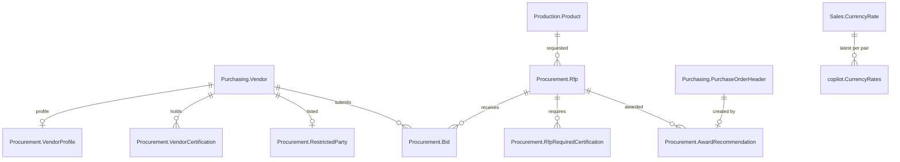

# Database backend (SQL Server + AdventureWorks2019)

The copilot can run on two data backends. `Data:Provider` selects one:

| Provider | Data | When |
|---|---|---|
| `Json` | the seed files under `data/` (Contoso scenario) | offline demos, `--fake`, CI, unit tests |
| `SqlServer` | AdventureWorks2019 plus the `Procurement` and `copilot` schemas added by the migrations (Adventure Works scenario) | the real demo: live vendors, purchase-order history, `query_readonly`, awards that create purchase orders |
| `Auto` (default) | SQL Server when `SqlServer:ConnectionString` is set, the server answers and the `copilot` schema exists; otherwise JSON with a warning | day-to-day use; `--fake` always forces `Json` |

`--self-check` and the `/data` console command show which backend is active and whether migrations are pending.

## Setup

1. Restore AdventureWorks2019 on a SQL Server 2019+ instance (SQL Server Express is enough). The default connection string in
   `src/ProcurementCopilot.Console/appsettings.json` and `src/ProcurementCopilot.Admin/appsettings.json` is
   `Server=localhost\SQLEXPRESS;Database=AdventureWorks2019;Integrated Security=True;TrustServerCertificate=True;Encrypt=True`.
   Override it with the `SqlServer__ConnectionString` environment variable or user-secrets; never commit SQL logins.
2. Apply the migrations (idempotent, safe to re-run):

   ```bash
   ./scripts/apply-migrations.sh          # or: pwsh ./scripts/apply-migrations.ps1
   ./scripts/apply-migrations.sh --status # only show applied / pending
   ```

   The scripts call `dotnet run --project src/ProcurementCopilot.Admin -- --migrate`, which runs every unrecorded file in
   `database/migrations/` in name order, batch by batch (`GO` separators), and records it in `Procurement.SchemaMigration`.
   The same runner is behind the **Apply pending migrations** button on the admin dashboard. `sqlcmd -i` works too,
   because every script records itself.
3. Run `dotnet run --project src/ProcurementCopilot.Console -- --self-check`. Expect `Data backend │ SqlServer …` and
   `Database migrations │ 4 applied, up to date`.

## Migration scripts

Every table, view, procedure or permission lives in a versioned script. **Never edit an applied script; add a new one**
(`0005_…sql`) that alters the object, and keep it idempotent (`IF NOT EXISTS`, `CREATE OR ALTER`, `MERGE`).

| Script | Creates |
|---|---|
| `0001_procurement_schema.sql` | schema `Procurement`; tables `SchemaMigration`, `Rfp`, `RfpRequiredCertification`, `VendorProfile`, `VendorCertification`, `Bid`, `RestrictedParty`, `AwardRecommendation` |
| `0002_copilot_views.sql` | schema `copilot`; views `Vendors`, `VendorCertifications`, `Rfps`, `Bids`, `RestrictedParties`, `CurrencyRates`, `Products`, `ProductVendorQuotes`, `PurchaseOrders`, `PurchaseOrderLines`, `AwardRecommendations` |
| `0003_copilot_procedures_and_security.sql` | procedure `copilot.usp_RecordAwardRecommendation`; database user `copilot_reader` (no login) with `SELECT` on schema `copilot` only, impersonation granted to the application connection |
| `0004_seed_demo_data.sql` | the demo scenario: RFP-2026-017 (open) and RFP-2026-012 (closed), five bids, five vendor profiles with certifications, one restricted party |

`database/maintenance/reset-demo-awards.sql` removes the purchase orders and award rows the copilot created
(`scripts/reset-demo.ps1 -Database` / `reset-demo.sh --database` run it).

## Schema



AdventureWorks tables are never altered. The only write into AdventureWorks is the stored procedure, which inserts a
**Pending** `Purchasing.PurchaseOrderHeader` (employee 261, ship method 1, both configurable) with one
`PurchaseOrderDetail` line for the RFP product and quantity at the winning unit price, inside one transaction with the
`Procurement.AwardRecommendation` row. It refuses restricted parties, closed RFPs and unknown ids with `THROW` messages
of the form `Code.Name: text`, which the application maps back to domain errors.

## Identifier mapping

| Domain | Database |
|---|---|
| `VND-nnnn` | `Purchasing.Vendor.BusinessEntityID` zero-padded to four digits (`VND-1498` = Trikes, Inc.) |
| `BID-nnn` | `Procurement.Bid.BidId`, a persisted computed column over the `BidNumber` identity |
| `RFP-YYYY-NNN` | `Procurement.Rfp.RfpId`, validated by a `CHECK` constraint and by `RfpId.Create` in the domain |
| FX rate | `copilot.CurrencyRates` = latest `Sales.CurrencyRate` end-of-day rate per pair (AdventureWorks quotes USD → X; the domain converter inverts when needed) |

## The demo scenario on real vendors

RFP-2026-017 "Supply of 2,000 HL Mountain Tires (TI-M823)", USD, weights 35/20/15/20/10, required ISO 9001 + ISO 4210.

| Bid | Vendor (BusinessEntityID) | Price | Lead | Warranty | Tech | Twist |
|---|---|---|---|---|---|---|
| BID-001 | Trikes, Inc. (1498) | USD 40.49 | 3 wk | 24 mo | 96 | existing supplier, ISO 14001 |
| BID-002 | Victory Bikes (1652) | USD 37.90 | 4 wk | 18 mo | 91 | credit rating 5, no ISO 14001, notes contain a prompt-injection string |
| BID-003 | International Bicycles (1526) | **EUR 38.20** | 2 wk | 36 mo | 94 | bids through a German subsidiary; converted at the latest USD→EUR rate |
| BID-004 | Proseware, Inc. (1678) | USD 33.75 | 2 wk | 12 mo | 88 | inactive in the vendor master; on the restricted-parties list |
| BID-005 | Sport Fan Co. (1632) | USD 40.99 | 4 wk | 30 mo | 98 | ambiguous ocean-freight delivery clause |

Expected result (pinned by `SqlBackendTests`): BID-003 94.60, BID-004 87.60 (blocked), BID-001 81.71, BID-005 80.92,
BID-002 66.87; recommendation International Bicycles, purchase order for 2,000 × USD 38.35.

## Security model

- The application connection (integrated security) reads through `copilot.*` views and writes only through
  `copilot.usp_RecordAwardRecommendation`; repositories never touch `Purchasing.*` tables directly.
- `query_readonly` queries are validated by `SqlQueryPolicy` (single `SELECT`, `copilot.*` only, no comments, variables,
  `EXEC`, DML, DDL, `sys`, `INFORMATION_SCHEMA`, cross-database names) **and** executed after `EXECUTE AS USER =
  'copilot_reader'`, a user that cannot read anything outside the `copilot` schema; `REVERT` always runs before the
  pooled connection is returned. Rows are capped (`SqlServer:QueryRowLimit`) and commands time out
  (`SqlServer:CommandTimeoutSeconds`). Every call needs analyst approval and is written to `audit/actions.jsonl`.
- The admin app edits the `Procurement` schema only; AdventureWorks master data is read-only in the UI.
- OpenTelemetry `SqlClient` instrumentation adds a `db.query` span under every tool span (statement text is not captured).

## Admin app

```bash
dotnet run --project src/ProcurementCopilot.Admin        # http://localhost:5010
```

Pages: **Dashboard** (backend, migration status, apply button, row counts), **RFPs** (create/edit/delete, product search,
weights, required certifications), **Bids** (per RFP, vendor picker, prices, clauses), **Vendors** (all 104 AdventureWorks
vendors; edit the copilot profile: country override, years trading, notes, certifications), **Restricted parties**
(add/remove), **Awards & POs** (what the copilot recorded, with the purchase order it created).
